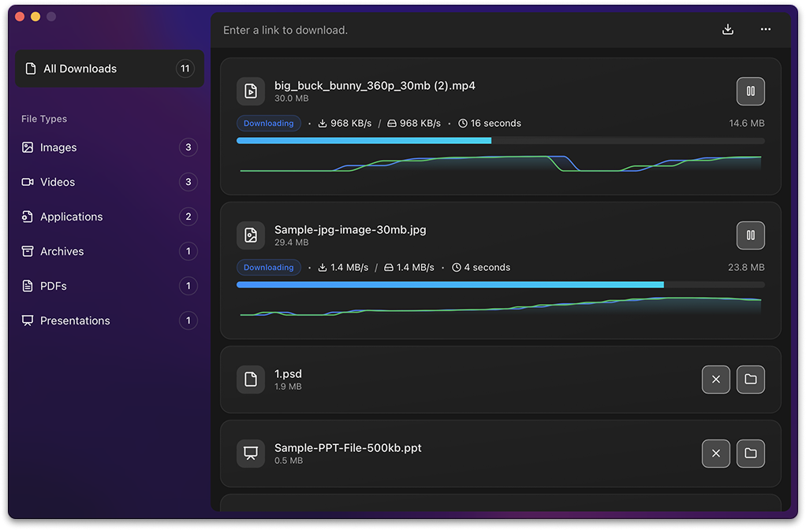

<p align="center">
  
</p>

<h1 align="center">Ferrix 🦀 ⬇️</h1>

<p align="center">
  <b>A blazing-fast, crash-resistant, and extensible download manager built with Rust + Tauri.</b>
</p>

<p align="center">
  <a href="https://github.com/mehranTaslimi/Ferrix/releases">
    
  </a>
  <a href="https://github.com/mehranTaslimi/Ferrix/stargazers">
    
  </a>
  <a href="https://github.com/mehranTaslimi/Ferrix/issues">
    
  </a>
  <a href="LICENSE">
    
  </a>
</p>

---

## 🚀 Features

- ⚡ **Parallel & Chunked Downloads** – maximize bandwidth with multi-threaded chunks
- 🔄 **Resumable Downloads** – pick up exactly where you left off, even after crashes
- 🌍 **Proxy Support** – HTTP/SOCKS5 proxies for privacy and flexibility
- 🛡 **Crash Safety + Data Integrity** – database-backed progress tracking
- ♻ **Automatic Retry** – smart reconnection with exponential backoff
- 🔌 **Modular Architecture** – future-ready for BitTorrent, plugins, and extensions
- 🖥 **Cross-Platform UI** – minimal, modern interface built with Tauri + TailwindCSS

---

## 📦 Installation

Download the latest version of Ferrix for your operating system from the **[Releases](https://github.com/mehranTaslimi/Ferrix/releases)** page.

1. Go to the [Releases page](https://github.com/mehranTaslimi/Ferrix/releases).
2. Find the latest release at the top.
3. Download the installer or archive for your platform:
   - **Windows** – `.msi` or `.exe`
   - **macOS** – `.dmg`
   - **Linux** – `.AppImage` or `.deb`
4. Install and run Ferrix 🚀

---

### 🖥 macOS Gatekeeper Fix (Unsigned App)

Ferrix is not code-signed (due to sanctions), so macOS may block it with an **"App is damaged or can’t be opened"** warning.  
Ferrix is open-source — you can review the code and build it yourself if you prefer.

To run it:

1. Move `Ferrix.app` to **Applications**
2. Open **Terminal** and run:

```bash
  xattr -r -d com.apple.quarantine /Applications/Ferrix\ \(Beta\).app
```

---

### 🪟 Windows SmartScreen Warning

Windows may show a **SmartScreen** warning because Ferrix is unsigned.  
To run it:

1. Click **More info**
2. Click **Run anyway**

---

## 🛠 Build from Source

### Prerequisites

- **Rust (stable)** & `cargo`
- **Node.js 18+** and **pnpm**
- **Tauri prerequisites**
  - **macOS**: Xcode Command Line Tools (`xcode-select --install`)
  - **Windows**: Visual Studio Build Tools (MSVC) + WebView2 Runtime
  - **Linux**: GTK/WebKitGTK and bundling deps (e.g., `libwebkit2gtk-4.0-dev`, `libgtk-3-dev`, `libayatana-appindicator3-dev`, `librsvg2-dev`, `patchelf`)

### Clone & Install

```bash
git clone https://github.com/mehranTaslimi/Ferrix.git
cd Ferrix
pnpm install
```

### Development (hot reload)

Use Tauri dev to run the desktop app with the frontend dev server:

```bash
pnpm tauri dev
#or
pnpm dev:all
```

### Release build (desktop binaries)

Build a production bundle for your OS:

```bash
pnpm tauri build
```

Artifacts will be in:

```
src-tauri/target/release/bundle/**
```

---

## 📸 Screenshots

<p align="center">
  
</p>

---

## 🏗 Architecture

Ferrix is built with a modern, modular architecture:

- **Rust** + **Tokio** – high-performance, memory-safe backend with powerful async networking
- **Tauri** – secure & lightweight cross-platform desktop framework
- **Next.js** + **ShadCN UI** – fast, component-driven frontend with beautiful and consistent design
- **SQLite** – reliable, crash-safe database for download progress tracking
