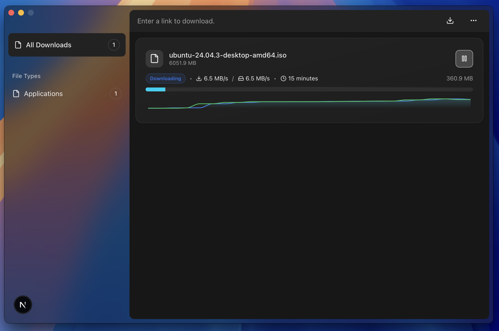

<p align="center">
  
</p>

# Ferrix 🦀 ⬇️

**Ferrix** is a modern, fast, and extensible download manager built with **Rust** and **Tauri**.  
It features resumable chunked downloads, a sleek web-based UI, and a modular architecture — all designed to handle real-world network instability like a pro.



---

## Features

- ✅ **Parallel & Chunked Downloads** – download files faster, chunk by chunk
- 🔁 **Resumable Downloads** – even after crashes or restarts
- 🌐 **Proxy Support** – HTTP/SOCKS5 proxies supported
- 🛠️ **Automatic Retry & Resume** – smart handling of connection failures
- 🧠 **Pluggable Architecture** – designed for future extensions (e.g., BitTorrent, plugins)
- 🖥️ **Cross-platform UI** – clean, responsive, and native-feeling UI with Tauri + TailwindCSS

---

## Installation

> **Currently in active development. Not yet released as an installer.**

To build Ferrix locally:

```bash
git clone https://github.com/mehranTaslimi/Ferrix.git
cd Ferrix
pnpm install
cargo tauri dev
```
